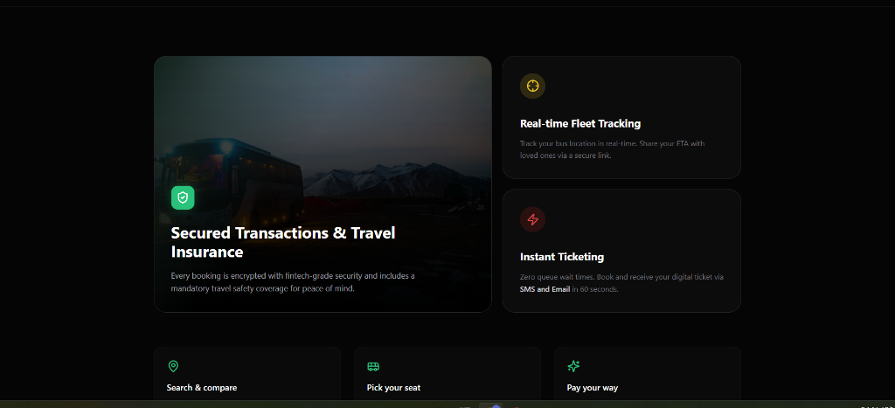
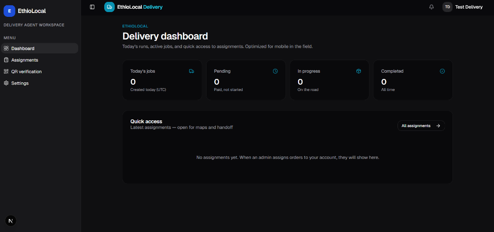
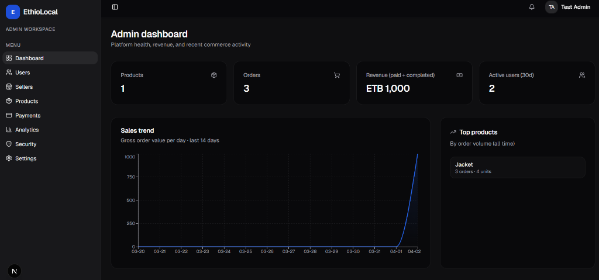
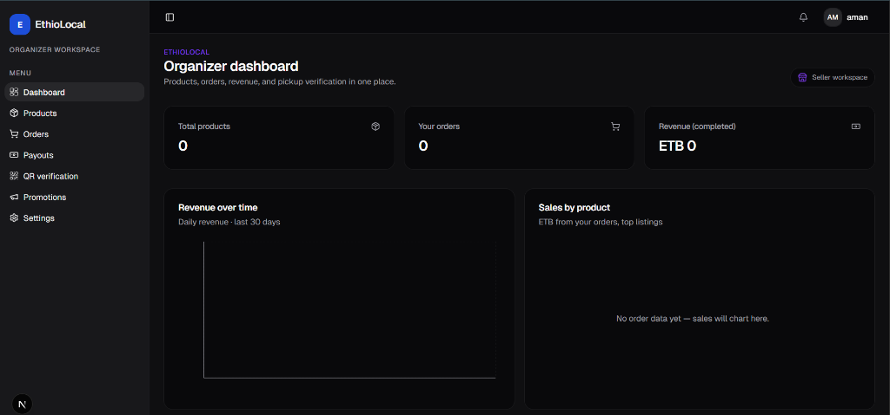
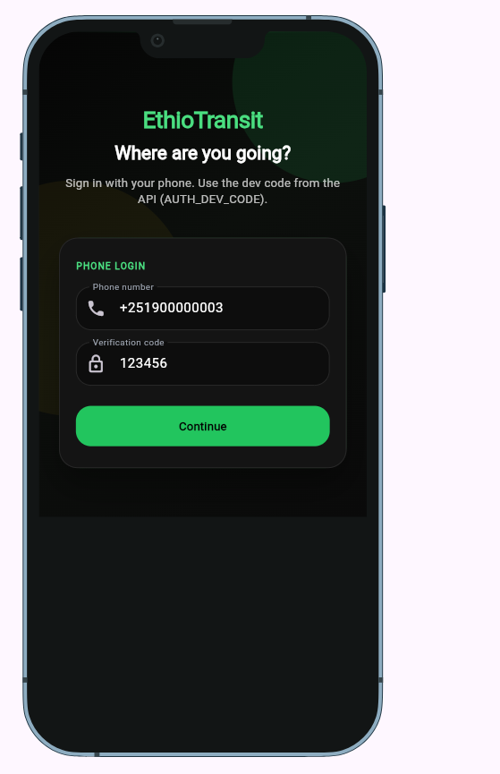
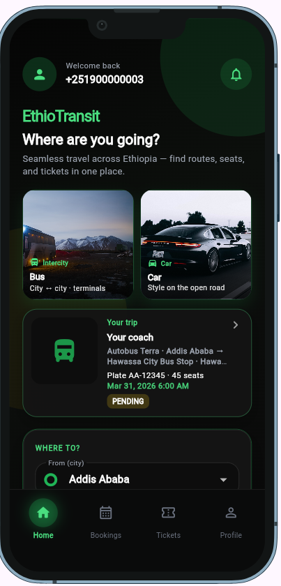
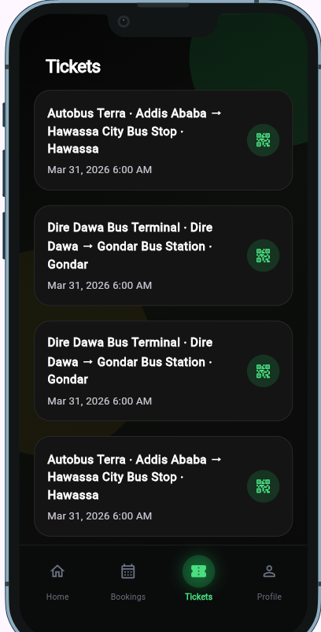
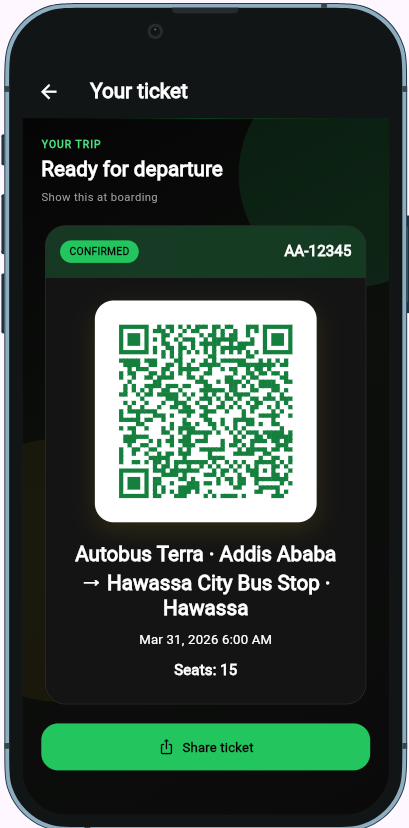
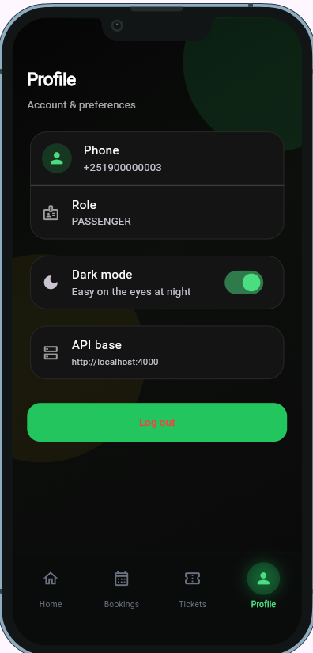

# EthioTransit

EthioTransit is a full-stack, multi-tenant transport platform. This repository is a **pnpm + Turborepo** monorepo: Next.js for the web UI, Flutter for mobile, Node.js for the REST API (M-Pesa and Chapa), and a Telegram bot (grammY).

## Screenshots










### Mobile App







## Layout

```
├── apps/
│   ├── web/       # Next.js UI only (calls apps/api; no embedded backend)
│   ├── mobile/    # Flutter (`ethiotransit_mobile`)
│   ├── api/       # Express + Prisma + PostgreSQL (multi-tenant API)
│   └── bot/       # Telegram bot (grammY)
├── packages/
│   ├── shared/    # Types, DTOs, payment enums, utils
│   ├── config/    # ESLint preset, Tailwind preset, payment env helpers
│   └── ui/        # Shared React components for web
├── turbo.json
├── package.json
├── pnpm-workspace.yaml
├── tsconfig.json
└── README.md
```

## Prerequisites

- **Node.js** 20+
- **pnpm** 9+ (or run via `npx pnpm@9.15.0 <command>`)
- **PostgreSQL** 14+ (for `apps/api`)
- **Flutter** SDK (for `apps/mobile`)

## Install

From the repository root:

```bash
pnpm install
```

## Common commands

| Goal | Command |
|------|---------|
| Dev (all Node apps + packages) | `pnpm dev` |
| Production build | `pnpm build` |
| Lint | `pnpm lint` |
| Web only | `pnpm --filter @ethiotransit/web dev` |
| API only | `pnpm --filter @ethiotransit/api dev` |
| Apply DB migrations (local / prod) | `pnpm --filter @ethiotransit/api db:migrate:deploy` |
| Migrate + seed (first-time local) | `pnpm --filter @ethiotransit/api db:setup` |
| Bot only | `pnpm --filter @ethiotransit/bot dev` |
| Mobile | `cd apps/mobile && flutter run` |

`pnpm dev` runs Turborepo with `dependsOn: ["^build"]` so workspace packages build before app dev servers start.

## API (EthioTransit backend)

**Tables only appear after migrations run.** Prisma does not auto-create them when you start the server.

1. Start PostgreSQL locally.
2. Create an empty database (name must match `DATABASE_URL`), e.g. in `psql`: `CREATE DATABASE ethiotransit;`
3. Copy [`apps/api/.env.example`](apps/api/.env.example) to `apps/api/.env` and set **`DATABASE_URL`** (user, password, host, port, database name) and JWT secrets.
4. Apply migrations (creates all tables):

   ```bash
   pnpm --filter @ethiotransit/api db:migrate:deploy
   ```

   For interactive dev workflows (new migration files), use `pnpm --filter @ethiotransit/api db:migrate` instead of `db:migrate:deploy`.

5. Seed dev users and sample data (optional but needed for login phones in seed):

   ```bash
   pnpm --filter @ethiotransit/api db:seed
   ```

   Or run migrate + seed in one command: `pnpm --filter @ethiotransit/api db:setup`.

6. Start the API: `pnpm --filter @ethiotransit/api dev`.

If `\dt` in `psql` (after `\c ethiotransit`) shows no tables, migrations did not run against that database—check **`DATABASE_URL`** points at the same DB you are inspecting.

**pgAdmin looks empty:** expand **Databases → ethiotransit** (not the default `postgres` database), then **Schemas → public → Tables**, and click **Refresh**. Until **`db:migrate:deploy`** succeeds, **Tables** will be empty. If migrate fails with **P1000 authentication failed**, fix the password in **`apps/api/.env`** (or in **`.env.example`** if you have no `.env`) so it matches the Postgres user you use in pgAdmin.

For production deployments against a managed database, use `prisma migrate deploy` (same as `db:migrate:deploy`) instead of `migrate dev`.

Regenerate the Prisma client after schema changes: `pnpm --filter @ethiotransit/api run generate` (same as `db:generate`). On **Windows**, if `prisma generate` fails with **`EPERM` / `rename` … `query_engine-windows.dll.node`**, another process is locking that file—stop **`pnpm dev`**, the API **`tsx watch`** process, and **Prisma Studio**, then run generate again.

The Prisma CLI only reads **`apps/api/.env`**, not `.env.example`. After **`pnpm install`**, a missing **`.env`** is created from **`.env.example`** (`bootstrap:env`). If you see **`Environment variable not found: DATABASE_URL`**, run **`pnpm --filter @ethiotransit/api bootstrap:env`** or prefer **`pnpm --filter @ethiotransit/api db:push`** (loads example when `.env` has no `DATABASE_URL`).

### Auth (JWT access + refresh)

| Method | Path | Notes |
|--------|------|--------|
| POST | `/api/v1/auth/login` | Body: `{ "phone", "code" }`. MVP: `AUTH_DEV_BYPASS=true` and `AUTH_DEV_CODE` (see `.env.example`). |
| POST | `/api/v1/auth/refresh` | Body: `{ "refreshToken" }`. |

Passengers must send `x-company-id` on tenant-scoped routes. Company users use `companyId` from the JWT.

### Core resources

| Method | Path |
|--------|------|
| GET | `/api/v1/health` |
| GET | `/api/v1/routes/search?origin=&destination=` |
| GET | `/api/v1/schedules/available?scheduleId=` or `?routeId=&from=&to=` (ISO dates) |
| POST | `/api/v1/bookings/create` |
| POST | `/api/v1/bookings/cancel` | Body: `{ "bookingId" }` — pending only; releases seat locks. |
| GET | `/api/v1/bookings/user` |
| GET | `/api/v1/bookings/company` (company role) |

### Payments

| Method | Path |
|--------|------|
| POST | `/api/v1/payments/mpesa/initiate` |
| POST | `/api/v1/payments/chapa/initiate` |
| POST | `/api/v1/payments/webhook` |

Register **M-Pesa** Daraja callback URL to `.../api/v1/payments/webhook` (same URL for Chapa where applicable). Webhook verifies Chapa HMAC when `CHAPA_WEBHOOK_SECRET` is set.

### Company & admin

| Method | Path |
|--------|------|
| GET | `/api/v1/company/dashboard` |
| GET | `/api/v1/company/revenue` |
| GET | `/api/v1/admin/companies` |
| GET | `/api/v1/admin/analytics` |
| POST | `/api/v1/public/operator-applications` (no auth; rate-limited) |
| GET | `/api/v1/admin/operator-applications` |
| POST | `/api/v1/admin/operator-applications/:id/review` |

**Onboarding bus companies (multi-tenant):** each operator submits **`POST /api/v1/public/operator-applications`** (see web **`/partners/apply`**). An **ADMIN** reviews under **`/admin/operator-applications`** and calls **`POST /api/v1/admin/operator-applications/:id/review`** with `{ "action": "approve" }` or `{ "action": "reject", "reason": "…" }`. **Approve** creates an **ACTIVE** `Company`, creates or upgrades the applicant’s `User` to **COMPANY** with that `companyId`, and links the application. The operator then signs in at **`/auth`** with the same phone. Manual company seeding remains possible for demos. **Suspend** operators via `PATCH /api/v1/admin/companies/:id`.

Without M-Pesa/Chapa keys, initiate endpoints return `503` with `mpesa_not_configured` / `chapa_not_configured`.

### Production configuration

When `NODE_ENV=production`, startup **requires**:

- `CORS_ORIGIN` (comma-separated allowed browser origins).
- `AUTH_DEV_BYPASS` must **not** be `true`.
- **M-Pesa webhooks:** set `MPESA_WEBHOOK_SECRET` (and send it as header `X-EthioTransit-Mpesa-Webhook-Secret` from your gateway) **and/or** `MPESA_WEBHOOK_IP_ALLOWLIST`, **or** set `WEBHOOK_INSECURE_ALLOW=true` only on private networks.
- **Chapa webhooks:** set `CHAPA_WEBHOOK_SECRET` (HMAC on raw body), **or** `CHAPA_WEBHOOKS_DISABLED=true` if you only use M-Pesa, **or** `WEBHOOK_INSECURE_ALLOW=true` for private testing.

Apply new DB constraints after pulling:

`pnpm --filter @ethiotransit/api exec prisma migrate deploy`

## Web app (`apps/web`)

**Frontend only:** this package is the Next.js UI. It does **not** embed a backend—there are no `app/api` route handlers for domain logic, no database clients, and no Prisma. **All business logic, auth, bookings, and payments live in [`apps/api`](apps/api)** (Express). The browser talks to that API over HTTP using **`NEXT_PUBLIC_API_URL`** (ensure **`CORS_ORIGIN`** on the API includes your web origin).

Next.js 15 (App Router) passenger and operator experience: Ethiopian-inspired theming (green / yellow / red accents, glass surfaces), **shadcn-style** primitives, **Framer Motion**, **next-themes**, **Recharts**, and **Lucide**. Routes include a public landing, OTP auth, search → schedules → seat map → checkout (M-Pesa / Chapa) → ticket with QR, bookings (cancel pending), company dashboard, and admin analytics.

Copy [`apps/web/.env.example`](apps/web/.env.example) to `apps/web/.env.local` and set **`NEXT_PUBLIC_API_URL`** to your API origin (for example `http://localhost:4000`).

### Admin dashboard (platform owner)

1. Run Postgres, apply migrations (see [API](#api-ethiotransit-backend)), then seed: **`pnpm --filter @ethiotransit/api db:seed`**. That upserts user **`+251900000001`** with role **ADMIN** (see [`apps/api/prisma/seed.ts`](apps/api/prisma/seed.ts)).
2. Start the web app and API (`pnpm dev` or filters for each).
3. Open **`/auth`**, sign in with **`+251900000001`** and the dev OTP matching **`AUTH_DEV_CODE`** in `apps/api` (default **`123456`** when using `.env.example`; match **`NEXT_PUBLIC_DEV_OTP`** on the web app for the on-screen hint).
4. You are redirected to **`/admin`** (System Analytics). You can also open **`/admin`** directly while logged in as that user.

**Passenger tenant:** the API requires the **`x-company-id`** header for passenger-scoped calls. After `pnpm --filter @ethiotransit/api exec prisma db seed`, copy the `Company.id` into **`NEXT_PUBLIC_OPERATORS_JSON`** (see `.env.example`) or **`NEXT_PUBLIC_DEFAULT_COMPANY_ID`**. A future **`GET /public/companies`** (or similar) would remove this friction.

**Auth storage:** access and refresh tokens are persisted in **`localStorage`**, which is convenient for development but exposes tokens to XSS. **Hardening:** prefer **httpOnly** cookies; optional Next.js Route Handlers may **proxy** requests to **`apps/api`** (they are not a second backend—only a same-origin bridge).

**Local `pnpm dev` issues:**

- **Web:** always run **`pnpm install` from the monorepo root** so `apps/web` gets `@radix-ui/*` and other deps (symlinked by pnpm). The default web dev script uses **`next dev`** (webpack) for reliable resolution on Windows; use **`pnpm --filter @ethiotransit/web dev:turbo`** if you want Turbopack.
- **API:** copy **`apps/api/.env.example`** → **`apps/api/.env`** for a persistent config. In **non-production**, if **`apps/api/.env`** is missing, the API and **`pnpm --filter @ethiotransit/api db:seed`** load **`.env.example`** automatically (still requires a reachable Postgres matching `DATABASE_URL`).
- **Bot:** set **`TELEGRAM_BOT_TOKEN`** and **`API_BASE_URL`** in `apps/bot/.env` (see [Telegram bot](#telegram-bot)).

## Telegram bot

**EthioTransit Transport Booking Bot** (`apps/bot`): **Telegraf** + **Axios**, talks to the same **`apps/api`** as web/mobile.

1. Copy [`apps/bot/.env.example`](apps/bot/.env.example) → `apps/bot/.env` and set **`TELEGRAM_BOT_TOKEN`** (from [@BotFather](https://t.me/BotFather)) and **`API_BASE_URL`** (e.g. `http://localhost:4000`).
2. Run the API and ensure a **passenger** user exists (e.g. seed `+251900000003` with dev OTP **`AUTH_DEV_CODE`**).
3. `pnpm --filter @ethiotransit/bot dev` (or `pnpm run build && pnpm start` in `apps/bot`).

**User flow:** `/start` → **Search bus** (popular routes or city pickers → date → route → trip → seat grid) → **Book** → **M-Pesa** or **Chapa** (uses `POST /api/v1/payments/mpesa/initiate` and `.../chapa/initiate`). In dev, mock payments complete immediately and the bot sends a ticket summary. **`/login <phone> <code>`** stores JWT + refresh in memory (per Telegram user; lost on restart). **`/bookings`** lists `GET /api/v1/bookings/user`.

Layout: `src/bot.ts` (entry), `src/commands/register.ts`, `src/handlers/`, `src/services/ethiotransit-api.ts`, `src/utils/`.

## Shared packages

- **`@ethiotransit/shared`** — payment enums, shared DTO types, small utilities.
- **`@ethiotransit/config`** — `getMpesaEnv()` / `getChapaEnv()` from `process.env`, plus optional ESLint and Tailwind presets (`@ethiotransit/config/eslint`, `@ethiotransit/config/tailwind`).
- **`@ethiotransit/ui`** — optional shared React primitives; the web app primarily uses **shadcn-style** components under `apps/web/src/components/ui`.

## Flutter note

`apps/mobile` is a standard Flutter project and is **not** wired into Turborepo tasks. Use the Flutter CLI for analyze, test, and builds.
